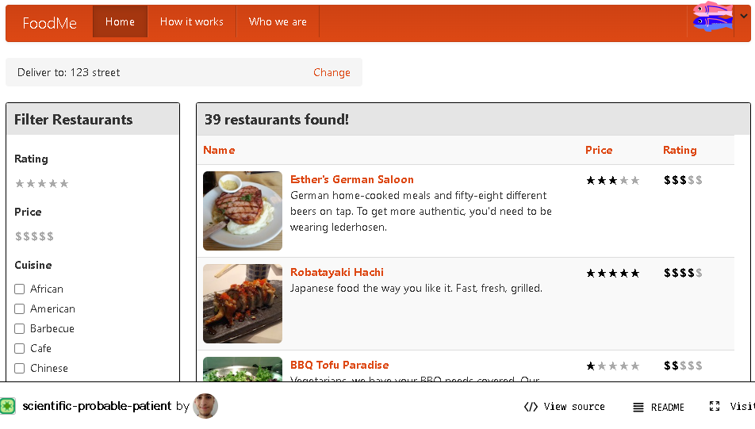
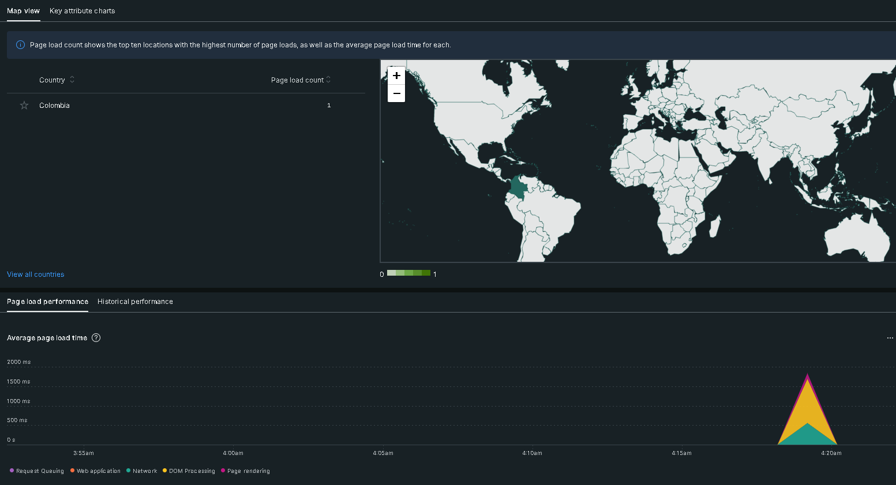
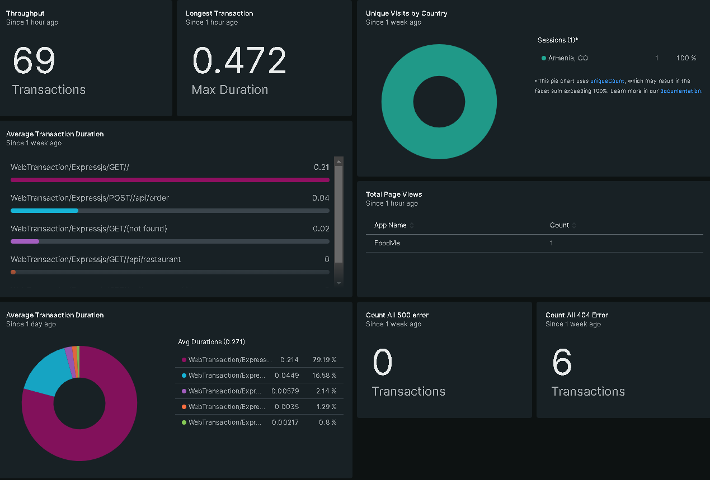
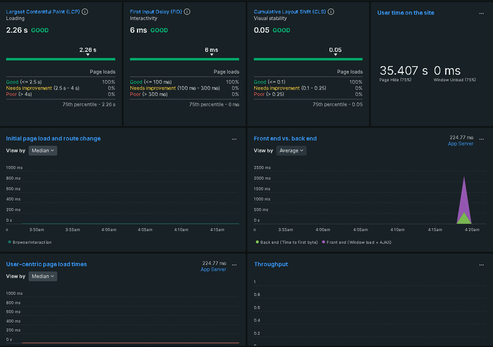
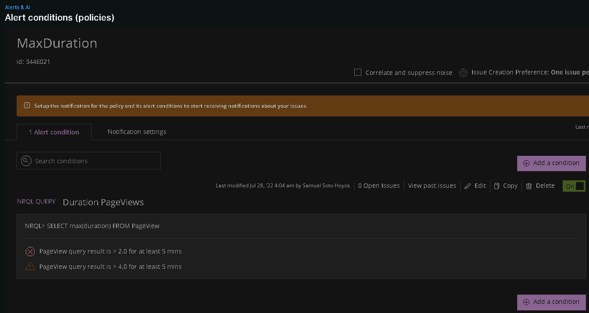
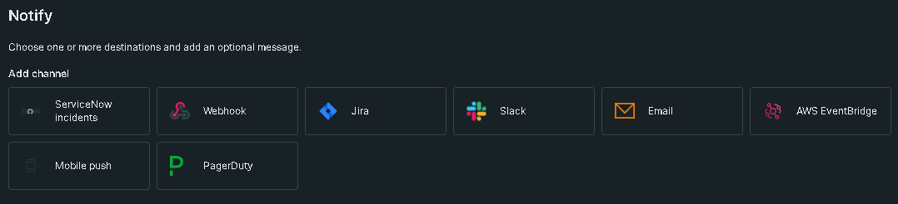

# New-Relic-Monitoring-Project-

## The App

Food Delivery app was built with AngularJS and Node.js backend and hosted at [Glitch](https://glitch.com/~scientific-probable-patient).

## Real time user monitoring

## Core Web Vitals

## Alerts Policies & Notify

